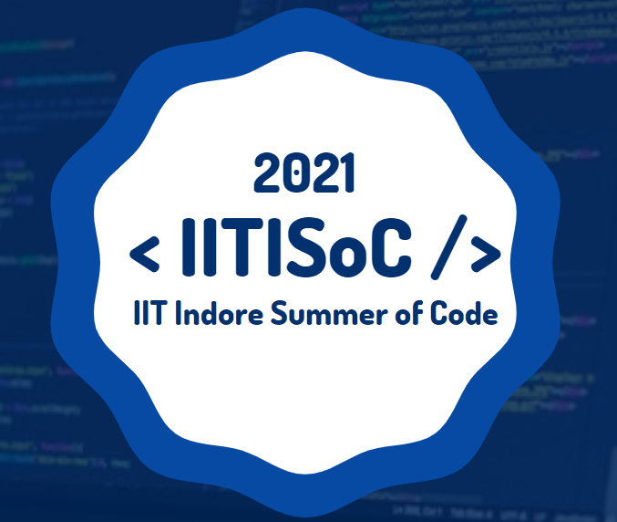

# **IITISoC'21 (AI/ML)** 

> IITISoC'20 is the annual dev Fest of IIT Indore which provides various opportunities to students to wok with cutting edge technologies in the domains of Web/App development, and Artificial Intelligence and Machine Learning. The participant teams are guided by a group of mentors, and are comprehensively evaluated at every step. This event is modelled on the pattern of GSoC, to inculcate in students an appreciation of open source and new technologies.
---

## ORGANISERS AND COORDINATORS
### [The Cynaptics Club IIT Indore]
### [The Programming Club IIT Indore]  
### [Google Developer Students Club IIT Indore]  
---

### Event Timeline
***15th July - 10th August 2021***

### Total Members
***~160 participants across 40+ teams***  

---

## PROJECT LIST
1. [News Articles Summarizer in Multiple Languages](https://github.com/snehithchinta/ML3-News-Article-Summarizer)
: Develop an effective end to end solution which accepts informative articles
in common languages used in India and summarizes them with a proper headline.
Further, as an addition, it should also be able to answer questions regarding the article
to the user.
    * #### *Team ML3 Contributers*
        > * [Snehith Chinta]()
        > * [Kothuru Sharvani]()
        > * [Shivani Rajaputhra]()
        > * [Siddartha Chennareddy]()
    * #### *Mentors ML3*
        > * [Aryan Rastogi](http://github.com/aryan-r22)
        > * [Vardhan Paliwal](https://github.com/Vardhan-08)
2. [Sentiment Analysis and Emotion Detection](https://github.com/abhijitpanda890/ML1-Sentiment-analysis-and-emotion-detection-.git)
: A model to gauge Sentiment of a given text/review. Additionally, it must be
able to detect emotions in the underlying text.
     * #### *Team ML1 Contributers*
        > * [Sanjit Vyas]()
        > * [Abhijit Panda]()
        > * [Nilay Kushawaha]()
    * #### *Mentors ML1*
        > * [Aryan Rastogi](http://github.com/aryan-r22)
        > * [Vardhan Paliwal](https://github.com/Vardhan-08)

3. [Image Captioning/ Video Summarizer](https://github.com/sid521/ML8-ImageCaptioning)
: Caption an image using DNN (Transfer Learning). Additionally, this project
can be extended to Video Summarization using NLP.
    * #### *Team ML8 Contributers*
        > * [Aditya Gouroju]()
        > * [Potu Sidhartha Reddy]()
        > * [PVSK Siddhardha]()
    * #### *Mentors ML8*
        > * [Aryan Rastogi](http://github.com/aryan-r22)
        > * [Bharat Kumar Gupta](https://github.com/bharat18001)
        > * [Kashish Bansal](https://www.github.com/kashi-123)
        > * [Sakshee Patil](https://github.com/Sakshee5)
4a. [Stone, Paper, Scissors](https://github.com/tanishq150802/ML7-RockPaperScissorGAME)
#Description:# Implement simple game using CV.
    * #### *Team ML7 Contributers*
        > * [Tanishq Selot]()
        > * [Kshitij M Bhat]()
        > * [Bhavya Dalal]()
    * #### *Mentors ML7*
        > * [Aryan Rastogi](http://github.com/aryan-r22)
        > * [Bharat Kumar Gupta](https://github.com/bharat18001)
        > * [Kashish Bansal](https://www.github.com/kashi-123)
        > * [Sakshee Patil](https://github.com/Sakshee5)
4b. [Stone, Paper, Scissors](https://github.com/anir-ab/ML18_Rock-Paper-Scissors-using-CV)
#Description:# Implement simple game using CV.
    * #### *Team ML18 Contributers*
        > * [Anirudha Bhagwat]()
        > * [Aditya Handa]()
        > * [Rounak Jain]()
    * #### *Mentors ML18*
        > * [Bharat Kumar Gupta](https://github.com/bharat18001)
        > * [Pranjal Gadge](https://github.com/pranjall29)
        > * [Siddhesh Shelke](http://github.com/sids-09)
4c. [Stone, Paper, Scissors](https://github.com/dedeepya2608/ML_19-ROCK_PAPER_SCISSORS)
#Description:# Implement simple game using CV.
     * #### *Team ML19 Contributers*
        > * [Divya Dedeepya Ankam]()
        > * [Abhinav Lade]()
        > * [Yash Mohan]()
        > * [Valsa Preetham]()
    * #### *Mentors ML19*
        > * [Bharat Kumar Gupta](https://github.com/bharat18001)
        > * [Pranjal Gadge](https://github.com/pranjall29)
        > * [Siddhesh Shelke](http://github.com/sids-09)
5a. [Face Mask Detecttion](https://github.com/MihirK1212/ML4_Face-Mask-Detection)
#Description:# Detects whether a person is wearing a face mask or not.
     * #### *Team ML4 Contributers*
        > * [Mihir Karandikar]()
        > * [Ayush Sinha]()
        > * [Nilay Ganvit]()
        > * [Akshat Nahata]()
    * #### *Mentors ML4*
        > * [Pranjal Gadge](https://github.com/pranjall29)
        > * [Rama Edlabadkar](https://github.com/skybluee2001)
        > * [Siddhesh Shelke](http://github.com/sids-09)
5b. [Face Mask Detecttion](https://github.com/Paarth002/Face-Mask-Detection)
#Description:# Detects whether a person is wearing a face mask or not.
    * #### *Team ML5 Contributers*
        > * [Parth Bhore](https://Github.com/vvkbhshn)
        > * [Nishchay Shroff](https://Github.com/ronnie-36)
        > * [Atharva Mohite](https://Github.com/Darkrevenger-crypto)
    * #### *Mentors ML5*
        > * [Pranjal Gadge](https://github.com/pranjall29)
        > * [Rama Edlabadkar](https://github.com/skybluee2001)
        > * [Siddhesh Shelke](http://github.com/sids-09)
5c. [Face Mask Detecttion](https://github.com/Sahas17/ML6-Face-Mask-Detection.git)
#Description:# Detects whether a person is wearing a face mask or not.
    * #### *Team ML6 Contributers*
        > * [Omkar singh]()
        > * [Byri Sahas Reddy]()
    * #### *Mentors ML6*
        > * [Pranjal Gadge](https://github.com/pranjall29)
        > * [Rama Edlabadkar](https://github.com/skybluee2001)
        > * [Siddhesh Shelke](http://github.com/sids-09)
6a. [Loan Status Prediction](https://github.com/Harshith1302/ML13_LoanStatusPrediction)
#Description:# Predicts whether the user got the loan or not based on the features like
education, marital status, income, dependents etc.
    * #### *Team ML13 Contributers*
        > * [Nakka Shankar]()
        > * [Padma Harshith]()
        > * [Madishetty Karthikeya]()
        > * [Aditi Thakur]()
    * #### *Mentors ML13*
        > * [Manav Trivedi](https://github.com/manavspg2)
        > * [Sakshi Pandey](https://github.com/sakshi012000)
6b. [Loan Status Prediction](https://github.com/Safdar16/ML14_Loan_Status.git)
#Description:# Predicts whether the user got the loan or not based on the features like
education, marital status, income, dependents etc.
    * #### *Team ML14 Contributers*
        > * [Nikhil Raizada]()
        > * [Safdar Wahid Inamdar]()
        > * [Ashutosh Nayak]()
    * #### *Mentors ML14*
        > * [Manav Trivedi](https://github.com/manavspg2)
        > * [Sakshi Pandey](https://github.com/sakshi012000)
7a. [Recommendation System with Spoiler Detection](https://github.com/a1-njos3/ML15_Recommendation-System-with-Spoiler-Detection)
#Description:# Can additionally do spoiler detection in reviews and hiding(some web dev related stuff).
    * #### *Team ML15 Contributers*
        > * [Alan Jose]()
        > * [Aayushi Chaubey]()
        > * [Chinmayi Adoni]()
    * #### *Mentors ML15*
        > * [Pranjal Gadge](https://github.com/pranjall29)
        > * [Rama Edlabadkar](https://github.com/skybluee2001)
7b. [Recommendation System with Spoiler Detection](https://github.com/Saurav-Raghaw/ML16-Recommendation-Sysytem)
#Description:# Can additionally do spoiler detection in reviews and hiding(some web dev related stuff).
    * #### *Team ML16 Contributers*
        > * [Saurav Kumar]()
        > * [Rupesh Kumar]()
        > * [Swastik Saxena]()
    * #### *Mentors ML16*
        > * [Pranjal Gadge](https://github.com/pranjall29)
        > * [Rama Edlabadkar](https://github.com/skybluee2001)
8. [Ads Click-Through Rate (CTR) Prediction](https://github.com/Yeeshukant/TeamCTR_CTR-prediction-using-ML-algorithms)
    * #### *Team ML11 Contributers*
        > * [Yeeshukant Singh]()
        > * [Nakshatram Shreyas]()
        > * [Alakh Rathore]()
        > * [Roshan Patidar]()
    * #### *Mentors ML11*
        > * [Manav Trivedi](https://github.com/manavspg2)
        > * [Rahul Kumar](https://github.com/ronnie-36)
9a. [Face Recognition](https://github.com/Nischit290402/Face_Recog.git)
#Description:# Recognize faces in an image using one shot learning. Additionally, develop
a web interface for the same.
    * #### *Team ML9 Contributers*
        > * [Nischit H]()
        > * [Karri Trivedi]()
        > * [Ramakrishna]()
    * #### *Mentors ML9*
        > * [Anjali Singhal](https://github.com/anjiii-18)
        > * [Bharat Kumar Gupta](https://github.com/bharat18001)
        > * [Miten Shah](http://github.com/mtnshh)
9b. [Face Recognition](https://github.com/ML10-Project/Face-Recognition)
#Description:# Recognize faces in an image using one shot learning. Additionally, develop
a web interface for the same.
    * #### *Team ML10 Contributers*
        > * [Amit Kumar Makkad]()
        > * [Bhavya Contractor]()
        > * [Priyansh Jaseja]()
    * #### *Mentors ML10*
        > * [Anjali Singhal](https://github.com/anjiii-18)
        > * [Bharat Kumar Gupta](https://github.com/bharat18001)
        > * [Miten Shah](http://github.com/mtnshh)
10. [AI Chatbot](https://github.com/me190003017/AI-CHAT-BOT)
#Description:# An AI chatbot to answer all the queries related to IIT Indore.
    * #### *Team ML17 Contributers*
        > * [Bhupendra Singh]()
        > * [Shravan Roy]()
    * #### *Team ML17 Mentors*
        > * [Sakshi Pandey](https://github.com/sakshi012000)
        > * [Siddhesh Shelke](http://github.com/sids-09)
